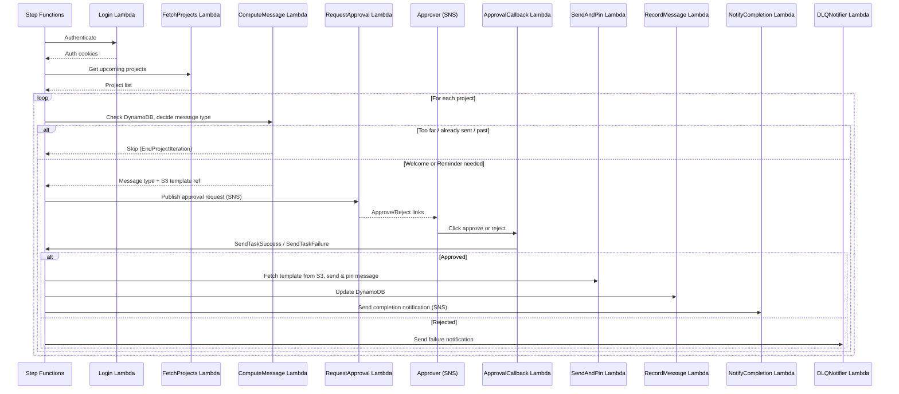

# NYC Cares Project Welcomer

A serverless notification system that sends welcome and reminder messages to New York Cares project attendees. Built with Go, AWS Lambda, and Step Functions.

## How It Works

A Step Functions state machine orchestrates the workflow, running once daily for each upcoming project:



### Message Timing

| Message  | Window                        |
|----------|-------------------------------|
| Welcome  | 7 days before → project date  |
| Reminder | 2 days before → project date  |

Each project (identified by name + date) receives at most one welcome and one reminder. State is tracked in DynamoDB.

## Project Structure

```
├── lambda/                  # 8 Lambda entry points + approval callback
├── internal/
│   ├── app/                 # Use cases (one per Lambda)
│   ├── domain/              # Domain models (Auth, Project, Notification)
│   ├── models/              # Lambda I/O serialization for Step Functions
│   ├── platform/            # AWS service integrations (DynamoDB, S3, SNS, HTTP)
│   ├── config/              # YAML/env var config loader
│   ├── endpoints/           # API URL constants
│   └── mockserver/          # Local mock of NYC Cares API
├── infra/                   # AWS CDK stack (Go)
├── integration/             # Integration tests (run against LocalStack)
├── seed/                    # S3 seed data for local dev
└── docker-compose.yaml      # LocalStack + mock server + CDK deploy + S3 seeding
```

## Getting Started

### Prerequisites

- Go 1.25+
- Docker & Docker Compose
- AWS CDK (for production deployment)

### Local Development

Start all services (LocalStack, mock server, CDK deploy, S3 seeding):

```bash
make up
```

This spins up:
- **LocalStack** — local AWS (DynamoDB, S3, SNS, Step Functions, Lambda, API Gateway)
- **Mock server** — simulates the NYC Cares API
- **CDK deploy** — provisions all infrastructure in LocalStack
- **S3 seeding** — uploads message templates

### Running Tests

```bash
# Unit tests
make test

# Integration tests (requires docker compose up)
make integration

# Format code
make fmt

# Lint
make lint
```

### Trigger a Workflow Execution

```bash
awslocal stepfunctions start-execution \
  --state-machine-arn arn:aws:states:us-east-1:000000000000:stateMachine:project-notifier-workflow
```

### Configuration

Locally, config loads from `config.yaml`. In Lambda, environment variables with the `NYCARES_` prefix are used. See `config.template.yaml` for the full structure.

| Variable                | Description                                    |
|-------------------------|------------------------------------------------|
| `NYCARES_CURRENT_DATE`  | Override current date (YYYY-MM-DD) for testing |
| `NYCARES_API_BASE_URL`  | Override NYC Cares API base URL                |

## DynamoDB Schema

**Table:** `Sent_Notifications`

| Attribute          | Type    | Description                          |
|--------------------|---------|--------------------------------------|
| `ProjectName` (PK) | String  | Project name                         |
| `ProjectDate` (SK) | String  | Project date (YYYY-MM-DD)            |
| `HasSentWelcome`   | Boolean | Welcome message sent                 |
| `HasSentReminder`  | Boolean | Reminder message sent                |
| `ShouldStopNotify` | Boolean | Disable notifications (cancelled)    |
| `LastUpdated`      | String  | ISO timestamp of last update         |

## CI/CD

- **PR to main:** Format check, unit tests, integration tests (via Docker Compose + LocalStack)
- **Push to main:** CDK deploy to AWS

## Tear Down

```bash
make down
```
